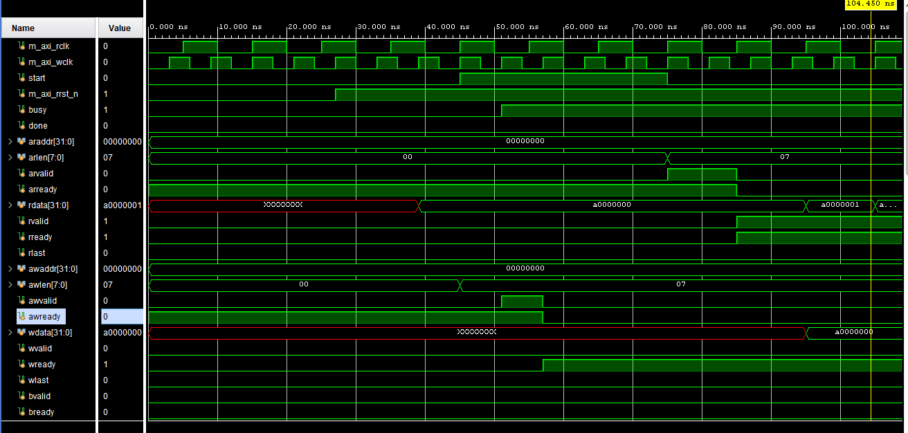
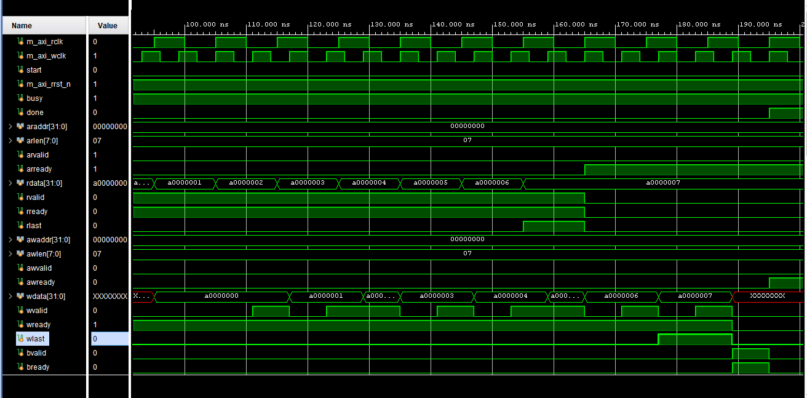

# AXI4 DMA Controller & Async FIFO

Acest proiect conține un controller DMA (Direct Memory Access) bazat pe protocolul AXI4, implementat în SystemVerilog. Designul execută transferuri de tip burst memorie-la-memorie și utilizează un FIFO asincron pentru a gestiona trecerea datelor între două domenii diferite de ceas (Clock Domain Crossing).

## Funcționalități Cheie
* **Interfețe AXI4 Master:** Module decuplate de citire și scriere care respectă protocolul complet de handshaking VALID/READY și backpressure.
* **Dual-Clock Asynchronous FIFO:** Trecerea datelor între ceasul de citire și cel de scriere se face în siguranță folosind pointeri Gray-code, evitând glitch-urile multi-bit.
* **Sincronizare CDC:** Prevenirea metastabilității prin sincronizatoare cu 2 bistabili (2-FF) și aplicarea atributelor Vivado `(* ASYNC_REG = "TRUE" *)`.
* **Constrângeri Timing:** Fișier `.xdc` configurat pentru a declara grupurile de ceas asincrone, necesar pentru analiza corectă la sinteză și implementare.

## Structura Repository-ului
* `SourceCode/` - Modulele RTL sintetizabile (Top DMA, AXI Masters, sub-module FIFO).
* `Simulation/` - Mediul de testare, incluzând `TB_DMA.sv` (generează stimulii dual-clock) și memoria slave simulată `axi_ram.sv`.
* `timing.xdc` - Constrângerile de ceas pentru Xilinx Vivado.

## Rulare Simulare
Proiectul poate fi simulat în Vivado Simulator (sau orice alt simulator compatibil SystemVerilog). Testbench-ul instanțiază două ceasuri distincte (100 MHz pentru citire, ~166 MHz pentru scriere) și verifică integritatea datelor după un transfer complet de tip burst.

## Forme de Undă (Waveforms)
Mai jos este prezentat comportamentul masterilor pe magistrala AXI și transferul datelor între domeniile asincrone de ceas:

